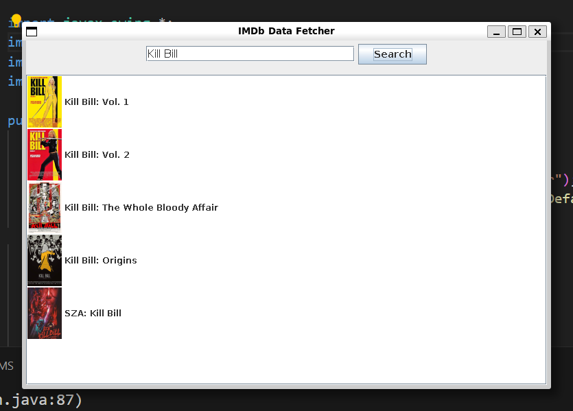

# IMDb Data Fetcher

## Description

A simple Java application that fetches and displays movie data from IMDb based on user input.

## Features

- Search movies by title.
- Display movie details including title, year, description, IMDb score, director, cast, and poster.

## Installation

1. Clone the repository:
    ```sh
    git clone https://github.com/your-username/imdb-data-fetcher.git
    ```
2. Navigate to the project directory:
    ```sh
    cd imdb-data-fetcher
    ```
3. Compile the Java files:
    ```sh
    javac -d bin src/com/github/sbkaleci/imdb_data_fetcher/*.java
    ```
4. Run the application:
    ```sh
    java -cp bin com.github.sbkaleci.imdb_data_fetcher.Main
    ```

## Usage

Run the application and enter a movie title in the search bar. The application will fetch and display relevant movie data from IMDb.

## Screenshots


*Search view*


*Movie details view*

## License

This project is licensed under the MIT License.
